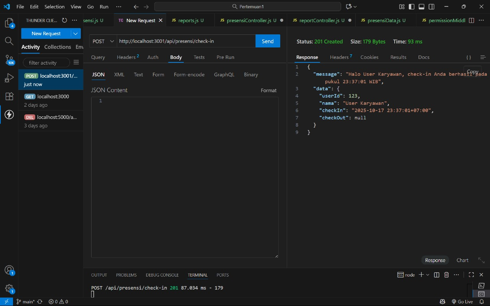
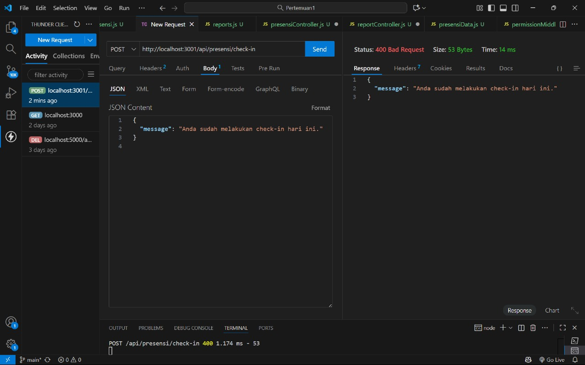
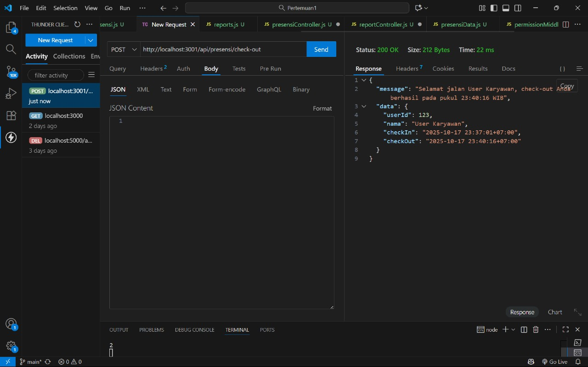
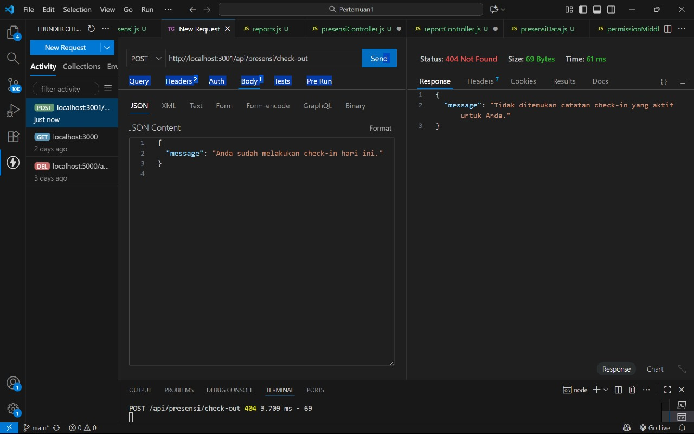
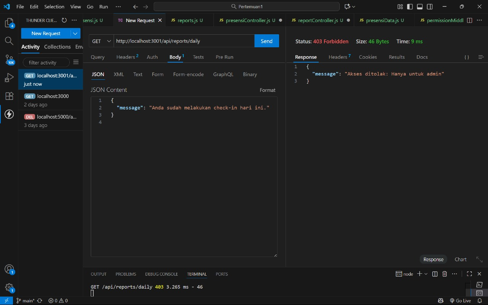

# Tugas 3 – Routing & Middleware di Express.js

## Screenshot Endpoint API

### 1️⃣ Check-in Pertama

### 2️⃣ Check-in Kedua (Gagal)

### 3️⃣ Check-out

### 4️⃣ Check-out Tanpa Check-in (Gagal)

### 4️⃣ reports daily (gagal)

